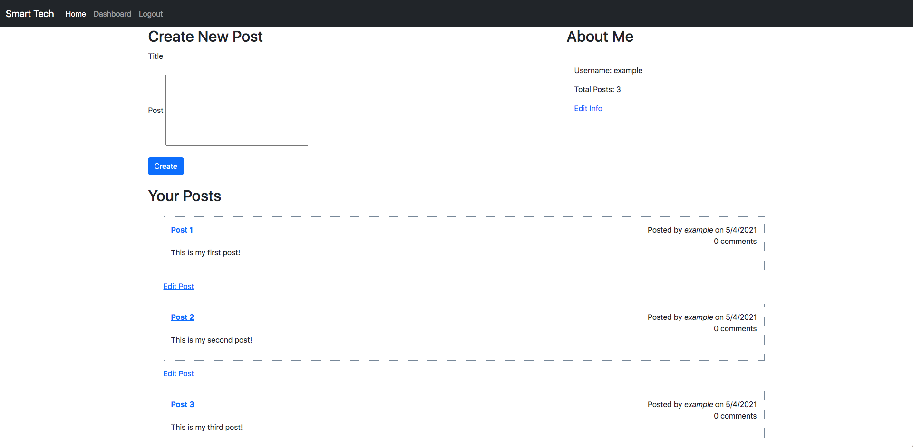
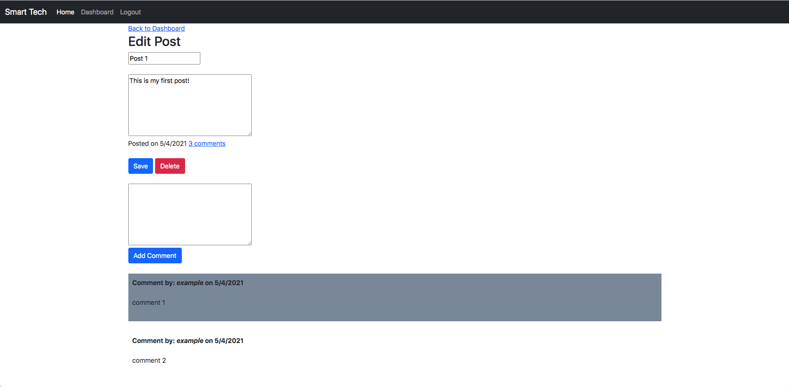

# Smart Tech

## Description

Smart Tech is a CMS-style blog, where developers can publish their blog posts and comment on other developers posts as well. This application follows the MVC paradigm in its architectural structure, using [Handlbars.js](https://handlebarsjs.com/guide/) as the templating language, [Sequelize](https://sequelize.org/) as the ORM, and [express-session](https://www.npmjs.com/package/express-session) npm package for authentication.

Deployed Application: https://evening-shore-41463.herokuapp.com/

## Table of Contents

- [Description](#description)
- [License](#license)
- [Installation](#installation)
- [Usage](#usage)
- [Contributors](#contributors)
- [Tests](#tests)
- [Questions](#questions)
- [Screenshots](#screenshots)

## License

License chosen: MIT.
More information about the license chosen can be found on [Open Source Initiative](https://opensource.org/licenses/MIT).

## Installation

A user can either use the application through its deployment on [Heroku](https://evening-shore-41463.herokuapp.com/), or they can clone it on to their local machine.

## Usage

The usage of this project is to create an blog-style application where developers can share new technologies, recent advancements, writing about technical concepts, etc.

## Contributors

[eroux13](https://www.github.com/eroux13)

## Tests

If a user wants to test this project, they first need to clone it to their local machine. Once the application has been cloned then they need to navigate to the project directory and then start the server by invoking `npm run start` in either Terminal or Git Bash depending on the users OS. The user can also use the integrated terminal within VS Code. From there, they can test the api endpoints through [Insomnia Core](https://insomnia.rest/).

## Questions

Feel free to follow my GitHub [profile](https://www.github.com/eroux13).
If you have any questions about this project, please reach out to me via ej.roux13@gmail.com.

## Screenshots

Homepage for when a user first visits the application.

Login & Sign up page

Once the user has either logged in or created an account, they will be redirected to their dashboard. From here, the user can add comments to existing posts, create posts, edit their created posts, or delete a post they created.

